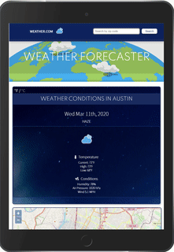
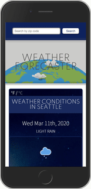

# Earth-Mars-Graphing

## Overview

Weather application that provides weather info for the user's current location, a five-day weather forecast, search capability, Fahrenheit - Celsius conversion, Weather news articles, and even a weather report from Mars.

## Features and Tech Used

- Uses localstorage to store state of the temperature for the user to easily switch between Celsius and Fahrenehit units
- Uses OpenWeather API to get search for data by geoLocation and zipcode
- Uses ZipCode API to convert zipcode into GeoCoordinates
- Uses the Nasa API to fetch Mars weather data
- Uses the newsapi API to collect weather-related news articles
- Uses openLayers to generate map based on geoLocation
- Built entirely from scratch with custom CSS (no bootstrap)
- Mobile Responsive thanks to CSS grid system
- Utilizes animations from [Lottie](https://lottiefiles.com/) and other free animated SVG icons from [here](https://www.amcharts.com/free-animated-svg-weather-icons/)

## Design

This application is fully responsive thanks to CSS grid. Here are some screen shots.

## Contact Me

If you have any questions, concerns, or comments please contact me at wandrew8@gmail.com. You can check out more of my work [here](http://www.andrewjohnweiss.com).
